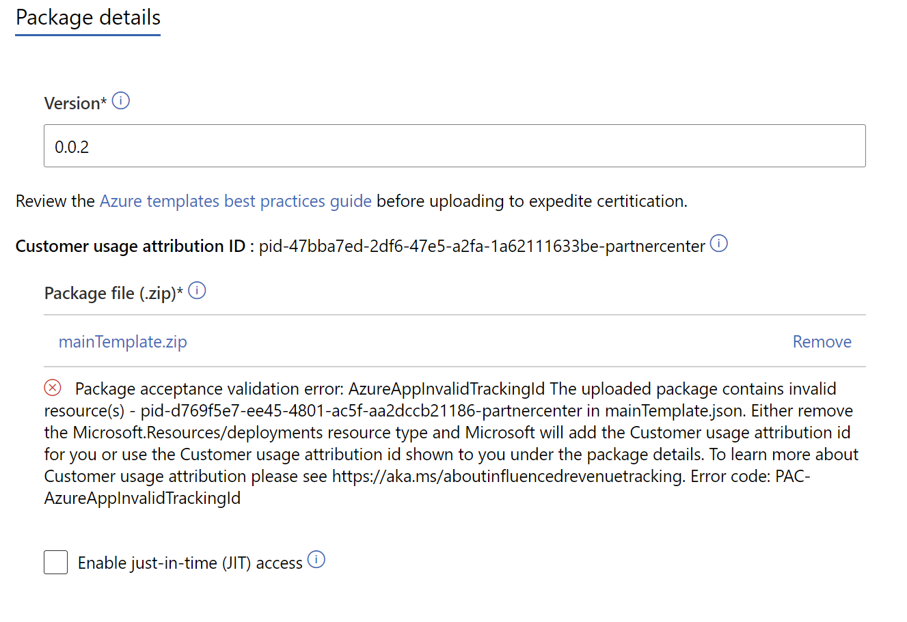

# Task 6: GUID registration in Partner Center + ARM template resource

## Introduction
In this challenge, you will create a GUID, register it in Partner Center and add this GUID to your ARM template file.

## Description
A GUID is a unique reference identifier that has 32 hexadecimal digits.
Why is this important? Customer usage attribution associates usage from Azure resources in customer subscriptions created while deploying your IP with you as a partner. Forming these associations in internal Microsoft systems brings greater visibility to the Azure footprint running your software.

Customer usage attribution supports three deployment options:

1. Azure Resource Manager templates
2. Azure Resource Manager APIs
3. Terraform

------------------

## Update from 1 Oct 2021
During Partner Center Publication, GUID will be automatically generated in (Commercial Marketplace, Offer) then Plan Overview -> Technical Configuration
Example of error:

Example of CUA (GUID, PID number):
**pid**-47xxxxxx-yyyy-yyyy-yyyy-xxxxxxxxxxxx-**partnercenter**

-----------------

For this challenge, you will use the first option: Azure Resource Manager templates

1. Go to Partner Center.
2. Copy the GUID that is already generated.
3. Register the GUID so it can be associated with you as a partner.
4. Add the GUID to your Resource Manager template.
5. Verify the deployment tracked with the GUID ((Optional. You can alternatively run the TTK against your script to check for any errors))
6. Upload your.zip package in Partner Center.

## Success Criteria

1. GUID successfully added to the ARM template.
2. Succesfully run the verification script against your deployment (Or TTK has no errors).
3. You can successfully add the .zip package in Partner Center.

## Learning Resources

- [Azure customer usage attribution](https://docs.microsoft.com/en-us/azure/marketplace/azure-partner-customer-usage-attribution#add-a-guid-to-a-resource-manager-template)
- [Configure a managed application plan](https://docs.microsoft.com/en-us/azure/marketplace/azure-app-managed#define-the-technical-configuration)
- [Plan an Azure managed application for an Azure application offer](https://docs.microsoft.com/en-us/azure/marketplace/plan-azure-app-managed-app)

