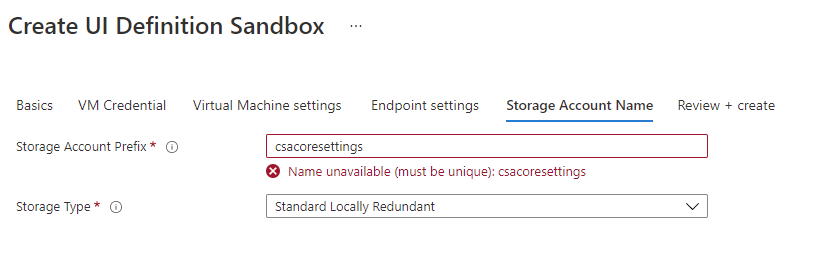
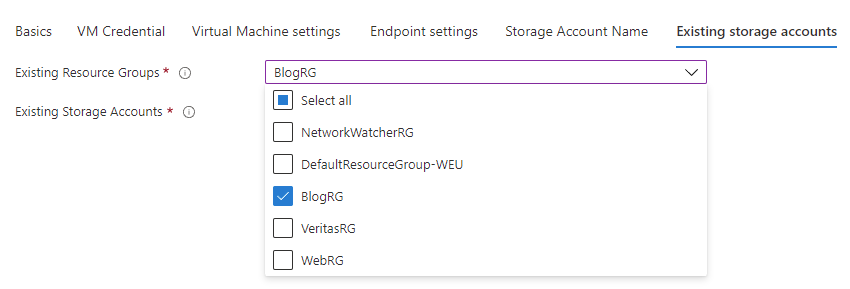

## Challenge 5: Customize the installer with more granular control

### Introduction

In this challenge we will tackle more precise requirements to create more user-friendly environment to deploy applications to Azure with additional modification of the design surface in Azure portal to help our customer with proper setup.

### Starting point

In order to complete the challenge, you need to have [prerequisites](./00-student-prereqs.md) finished and have **at least** [Challenge 2 completed](./02-student-modify_and_redeploy.md) in order to continue with below tasks.

In the **[Resources](./Resources)** folder you will find all necessary files to complete [Challenge 1](./01-student-deploy_to_service_catalog.md), [Challenge 2](./02-student-modify_and_redeploy.md), [Challenge 3](./03-00-student-create_azure-marketplace-offer.md) and [Challenge 4](./04-01-student-app-deployment.md) if you haven't already. 

### Success criteria

Your task is to provide custom form, where users can:
1. enter a name for the storage account, which contains **only** letters (without hypens or underscores) in range of min 4 and max 8 characters in a provided textbox
2. have an ability to select dropdown about the storage type (options should be single select and 3 values should be provided - **Standard Locally Redundant**, **Premium Locally Redundant** and **Standard Globally Redundant**) to minimize the costs
3. name should be **validated** to be unique inside selected subscription before you move to the next final step
4. selected name should be applied to the outputted name for the storage account created in the form to be able to be used in package deployment to Azure
5. managed application needs to deployed to partner center to reflect the changes

__Example__:

**Bonus:**
-   make additional step in the wizard to select storage account based on selected resource groups from the subscription

##Learning Resources
- [Azure Sandbox for validating and testing UI](https://portal.azure.com/?feature.customPortal=false#blade/Microsoft_Azure_CreateUIDef/SandboxBlade)
- [Configure Managed Application Plan - Partner Center](https://docs.microsoft.com/en-us/azure/marketplace/azure-app-managed#choose-who-can-manage-the-application)
- [Types of Azure Apllication offer plans](https://docs.microsoft.com/en-us/azure/marketplace/plan-azure-application-offer#types-of-plans)
- [Azure REST Api reference](https://docs.microsoft.com/en-us/rest/api/azure/)
- [Microsoft.Solutions.ArmApiControl UI element](https://docs.microsoft.com/en-us/azure/azure-resource-manager/managed-applications/microsoft-solutions-armapicontrol)